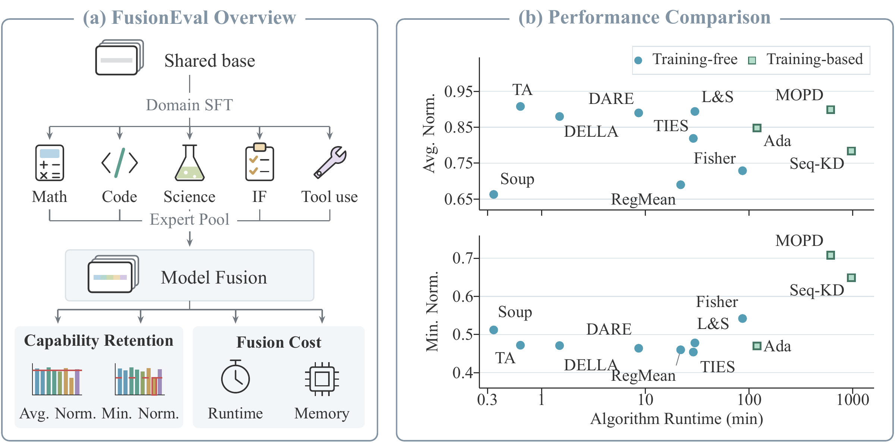

# FusionEval

大语言模型融合基准

[English](README.md) | [简体中文](README.zh-CN.md) · [模型与数据](https://huggingface.co/David6995) · [论文](paper/main.pdf)

FusionEval 使用同一基座训练的数学、代码、工具使用、指令遵循和科学领域专家，比较不同融合方法的能力保留、耗时和峰值 GPU 显存。仓库提供 Qwen3-4B、Qwen3-8B 和 Llama 3.2 3B 的参数融合与持续融合配置，以及 Qwen3-4B/8B 的蒸馏脚本。



## 👋 从这里开始

```bash
git clone https://github.com/Baicaihaochi/FusionEval_Benchmark.git
cd FusionEval_Benchmark
```

首次使用可先跑 Qwen3-4B 的 TA：安装环境 → 准备模型 → 运行融合。TA 不需要校准数据；已有环境和本地模型时，可直接填写 YAML 路径后运行。

| 模型 | 配置目录 | 下载选项 |
|---|---|---|
| Qwen3-4B | [examples/qwen3-4b](examples/qwen3-4b) | `--model qwen3-4b` |
| Qwen3-8B | [examples/qwen3-8b](examples/qwen3-8b) | `--model qwen3-8b` |
| Llama 3.2 3B | [examples/llama3.2-3b](examples/llama3.2-3b) | `--model llama3.2-3b` |

## 🛠️ 安装环境

进入已有 NVIDIA GPU 可用的计算节点，在仓库根目录使用 [uv](https://docs.astral.sh/uv/getting-started/installation/) 安装环境：

```bash
bash scripts/setup/uv.sh
source .venv/bin/activate
```

环境默认建在 `.venv/`，使用 Python 3.11、PyTorch CUDA 12.8 和 **Transformers 4.57.1**。依赖列在 `requirements.txt` 中。如需更换 PyTorch 后端：

```bash
TORCH_BACKEND=cu126 bash scripts/setup/uv.sh
```

## 📦 准备模型与数据

按需下载对应模型的共同 base 和五个专家：

```bash
python scripts/download/models.py --model qwen3-4b
# 其他选项：--model qwen3-8b | --model llama3.2-3b

python scripts/download/data.py  # 校准数据：每个领域 128 条
```

默认存放位置：

```text
models/<model>/{base,math,code,agent,if,science}/
data/calibration/data/{math,code,agent,if,science}.jsonl
```

`<model>` 为 `qwen3-4b`、`qwen3-8b` 或 `llama3.2-3b`。已有文件时，直接在实验 YAML 中填写路径即可，无需下载。专家须来自相同 base，并使用一致的架构和 tokenizer。

下载脚本支持 `--output-dir` 和仅预览的 `--plan`。用 `--include base math code` 选择模型。其他数据可通过 `--dataset sft`、`--dataset mopd`、`--dataset student` 下载；校准和 SFT 数据还支持 `--domains math code`。下载使用当前 Hugging Face 登录状态与网络设置。

## 🚀 运行融合

每个实验使用一个 YAML 文件：

```bash
CUDA_VISIBLE_DEVICES=0 bash run.sh examples/qwen3-4b/ta.yaml
CUDA_VISIBLE_DEVICES=0 bash run.sh examples/qwen3-8b/ta.yaml
CUDA_VISIBLE_DEVICES=0 bash run.sh examples/llama3.2-3b/ta.yaml
```

选择其中一条执行，每次运行使用一张 GPU。也可以在 `launch.sh` 中设置 GPU 和配置路径，再执行 `bash launch.sh`。

每个模型目录均提供以下方法：

| 配置文件 | 方法 | 额外输入 |
|---|---|---|
| `soup.yaml` | 均匀平均 | 无 |
| `ta.yaml` | Task Arithmetic | 无 |
| `ties.yaml` | TIES | 无 |
| `dare.yaml` | DARE | 无 |
| `della.yaml` | DELLA | 无 |
| `localize_stitch.yaml` | Localize-and-Stitch | 无 |
| `fisher.yaml` | Fisher | 校准数据 |
| `adamerging.yaml` | AdaMerging | 校准数据 |
| `regmean.yaml` | RegMean | 校准数据 |
| `featcal.yaml` | FeatCal | 校准数据、初始融合模型 |
| `surgery.yaml` | Surgery | 校准数据、初始融合模型 |

运行 FeatCal/Surgery 前，先运行 TA，将 `initial_model` 指向其输出，或将该结果保存到 `models/<model>/initial/`。Surgery 生成领域适配器，通过 `fusioneval.methods.surgery.runtime` 中的 `surgery_context` 使用。

Llama 配置适用于 David6995 下发布的完整 Hugging Face 权重。其参数沿用 Qwen 配置作为起始值，尚未验证真实 Llama 模型融合。

### 修改实验配置

| 设置 | YAML 字段 |
|---|---|
| Base 与专家路径 | `base`、`experts[].path` |
| 专家数量 | 增删 `experts` 条目 |
| 方法与参数 | `method`、`parameters` |
| 数据 | `experts[].data`；共享数据使用 `calibration_data` |
| 架构预设 | `model_profile` |
| 计算与保存精度 | `runtime.precision`、`runtime.save_dtype` |
| 结果与日志路径 | `output`、`log` |

示例默认融合五个专家。修改数量时，相应调整各专家的系数。切换方法时，使用对应模板的 `method` 和 `parameters`。

模型和数据路径为 `null` 时，使用上述默认目录。显式填写的相对路径以 YAML 所在目录为基准，也可使用绝对路径。

例如，只融合 Math 和 Code 两个专家，系数设为 0.3。先复制一份 TA 配置：

```bash
cp examples/qwen3-4b/ta.yaml examples/qwen3-4b/my_ta.yaml
```

在 `my_ta.yaml` 中替换以下字段，其余保持不变：

```yaml
base: null
experts:
  - id: math
    path: null
  - id: code
    path: null
parameters:
  scale: 0.3
output: null
```

```bash
CUDA_VISIBLE_DEVICES=0 bash run.sh examples/qwen3-4b/my_ta.yaml
```

把 `path: null` 换成自己的 checkpoint 目录即可使用本地模型。该目录应包含 `config.json`、tokenizer 文件和完整的 safetensors 权重。

计算精度可选 `bfloat16` 或 `float32`；DELLA 和 continual DELLA/RegMean 使用 FP32 计算。`save_dtype` 单独控制权重的保存精度。校准数据支持 JSONL 对话（`messages`）或已分词的 `input_ids`，须使用对应模型的 tokenizer 和对话模板。

只预览配置、不加载权重：

```bash
bash run.sh examples/qwen3-4b/ta.yaml --plan
```

## 📁 保存结果

`output: null` 时，每次运行创建独立目录：

```text
outputs/ta/qwen3-4b_m5_s0.3_a7c2e9f1/
```

名称包含模型、专家数量、主要参数和随机后缀。持续融合结果放在 `outputs/continual/<method>/` 下。

如需指定完整保存位置，在 YAML 中填写：

```yaml
output: ../../outputs/my_ta_model
log: null  # run.log 保存在结果目录内
```

已有模型不会被覆盖。将 `log` 设为 `.log` 文件路径可单独保存日志。结果目录还包含 `run_config.yaml`、`run_status.json` 和方法记录。失败后应检查运行状态，仅有日志的目录不代表融合完成。

日志最后一行汇报运行时间和峰值 GPU 显存，例如：

```text
Runtime summary | status=SUCCESS | algorithm=289.80s | wall=318.25s | peak_gpu_memory=9.420 GiB (PyTorch allocated)
```

`algorithm` 沿用方法记录的时间，包含准备、融合、保存与验证；`wall` 为本次完整运行的耗时。峰值显存统计本次进程在所选 GPU 上由 PyTorch 分配的内存，覆盖整个运行，不含其他进程和 CUDA 上下文占用。Resume 只汇总本次新执行阶段的算法时间。CPU 运行或显存统计不可用时显示 `N/A`，数值同时写入 `run_status.json`。此汇报适用于融合与持续融合；外部 Slime 蒸馏使用其训练日志。

## 🔄 持续融合与恢复

每个模型的 `continual/` 目录提供 Soup、TA、TIES、DELLA 和 RegMean。默认顺序为 IF → Math → Science → Code → Agent，可通过 `initial` 和 `order` 修改。

```bash
CUDA_VISIBLE_DEVICES=0 bash run.sh examples/qwen3-4b/continual/ties.yaml
```

恢复中断的任务时，将 `output` 设为该次运行的完整目录路径，保持输入与参数不变，然后执行：

```bash
CUDA_VISIBLE_DEVICES=0 bash run.sh examples/qwen3-4b/continual/ties.yaml --resume
```

已完成阶段直接复用，未完成阶段重新计算。若已保存的阶段目录不完整，程序会报错。`--stop-after 2` 可在完成两次更新后停止。

向已有融合模型追加专家时，将它设为 `initial`，用 `initial_experts` 声明其包含的专家数量，`order` 中只列新增专家，并为本次运行使用新的输出位置。

持续融合使用当前模型和新专家。TA、TIES、DELLA 还需固定的 base。RegMean 在新领域数据上重新计算两个模型的统计量，不依赖历史统计，通常不等价于批量 RegMean。DELLA 每次更新使用独立随机种子。

## 🧪 蒸馏

Qwen3-4B/8B 蒸馏脚本：`examples/distillation/{mopd,seqkd}_{4b,8b}.sh`。在兼容的 Megatron/SGLang/CUDA 训练环境中，从仓库根目录安装 [Slime](slime)：

```bash
python -m pip install --no-deps -e ./slime
```

蒸馏需单独准备训练环境，Python 依赖见 `slime/requirements.txt`。原容器的私有依赖未包含在内，这份导出尚未完成完整训练验证。

在脚本开头填写学生 checkpoint 路径、`STUDENT_STEP`、`PROMPT_DATA`、`OUTPUT_DIR` 和 `MEGATRON_ROOT`，在 `ARGS` 中修改训练参数。`SLIME_ROOT` 默认使用仓库源码。

### MOPD

填写五个 `TEACHER_*_MODEL` 路径。数据须包含 `messages` 和 `metadata.teacher`，教师名称为 `math`、`if`、`code`、`science` 或 `agent`。MOPD 在已分配的单机或双机上启动 Ray 和教师，每台需 8 张 GPU：

| `NODE_COUNT` | Head node | Worker node |
|---|---|---|
| `1` (default) | GPUs 0-2: student training/rollout; GPUs 3-7: teachers | None |
| `2` | GPUs 0-7: student training | GPUs 0-2: student rollout; GPUs 3-7: teachers |

```bash
bash examples/distillation/mopd_4b.sh --plan  # 仅预览
bash examples/distillation/mopd_4b.sh
```

双机设置 `NODE_COUNT=2`、`HEAD_IP` 和 `WORKER_IP`。两台机器须环境和文件路径一致、网络互通。主节点运行上述命令，第二节点运行：

```bash
bash examples/distillation/mopd_4b.sh --worker
```

服务日志：`OUTPUT_DIR/services/`。训练结束后主节点服务自动停止，第二节点按 Ctrl-C 退出。并行度、batch size 和端口直接在脚本中修改。

使用已有 Ray 和教师服务时，填写 `LOCAL_SERVICES=0`、`RAY_JOB_ADDRESS` 和五个以 `/generate` 结尾的 `TEACHER_*_URL`。

### Seq-KD

Seq-KD 使用已有 Ray 集群，需填写 `RAY_JOB_ADDRESS`。论文使用 25,600 条教师生成的回答。每条样本分词后保留前 4096 个 token，记录截断后的回答长度：

```json
{"metadata":{"seqkd_token_ids":[1,2,3],"seqkd_response_length":1}}
```

```bash
bash examples/distillation/seqkd_4b.sh --plan
bash examples/distillation/seqkd_4b.sh
bash examples/distillation/seqkd_4b.sh --resume "$RESUME_CHECKPOINT"
```

保持数据行顺序，保留截断后回答长度为零的行。恢复训练需要相同数据、优化器状态和数据游标。学生权重和教师回答需另行准备，Student 数据集不包含这两项。

## 💡 常见问题

| 情况 | 处理方式 |
|---|---|
| 输出目录已存在 | 新实验使用 `output: null` 或新的路径；恢复持续融合时指定原路径并加 `--resume`。 |
| FeatCal/Surgery 找不到初始模型 | 先运行对应模型的 TA，将其输出路径填入 `initial_model`。 |

阅读[论文 PDF](paper/main.pdf)。

## 📊 结果

### Qwen3-4B

| Method | AIME24 (%) | AIME25 (%) | LCBv5 (%) | LCBv6 (%) | GPQA-D (%) | IFEval (%) | IFBench (%) | BFCLv3 (%) | Raw Avg. (%) | Avg. Norm. | Min. Norm. |
|---|---:|---:|---:|---:|---:|---:|---:|---:|---:|---:|---:|
| Experts | 73.4 | 67.4 | 44.4 | 41.6 | 51.9 | 86.0 | 38.6 | 66.0 | 58.7 | 1.000 | 1.000 |
| TIES | **69.0** | 64.4 | 41.6 | 35.9 | 36.9 | 65.3 | 36.2 | 30.0 | 47.4 | 0.819 | 0.454 |
| RegMean | 43.5 | 40.2 | 31.5 | 29.4 | 47.1 | 68.9 | 28.7 | 30.4 | 40.0 | 0.690 | 0.460 |
| DARE | 66.9 | 62.5 | 47.5 | **42.6** | 49.0 | 70.9 | 37.0 | 30.6 | 50.9 | 0.890 | 0.464 |
| Ada | 67.5 | 58.8 | 42.3 | 38.7 | 49.6 | 66.6 | 35.0 | 31.0 | 48.7 | 0.848 | 0.470 |
| DELLA | 68.5 | 64.8 | 47.0 | 40.8 | 49.5 | 64.4 | 36.0 | 31.1 | 50.3 | 0.880 | 0.471 |
| TA | 67.5 | **67.1** | 48.2 | 42.2 | **51.4** | 69.4 | 37.8 | 31.1 | 51.8 | **0.908** | 0.472 |
| L&S | 67.1 | 62.5 | **49.3** | 39.5 | 44.6 | 70.3 | **42.3** | 31.5 | 50.9 | 0.894 | 0.478 |
| Soup | 45.4 | 35.6 | 27.8 | 27.5 | 51.3 | 62.9 | 24.8 | 33.8 | 38.6 | 0.663 | 0.512 |
| Fisher | 39.8 | 38.1 | 38.2 | 31.9 | 47.1 | 63.9 | 29.6 | 45.1 | 41.7 | 0.729 | 0.542 |
| **Distillation** | | | | | | | | | | | |
| Student | 49.1 | 47.9 | 33.5 | 31.5 | 30.9 | 64.8 | 27.8 | 63.7 | 43.7 | 0.741 | 0.596 |
| Seq-KD | 47.9 | 43.8 | 36.4 | 31.9 | 34.5 | 67.7 | 37.5 | 63.7 | 45.4 | 0.784 | 0.649 |
| MOPD | 59.6 | 53.3 | 42.8 | 38.9 | 36.7 | **77.5** | 41.4 | **66.1** | **52.1** | 0.899 | **0.708** |

### Qwen3-8B

| Method | AIME24 (%) | AIME25 (%) | LCBv5 (%) | LCBv6 (%) | GPQA-D (%) | IFEval (%) | IFBench (%) | BFCLv3 (%) | Raw Avg. (%) | Avg. Norm. | Min. Norm. |
|---|---:|---:|---:|---:|---:|---:|---:|---:|---:|---:|---:|
| Experts | 74.6 | 67.9 | 47.3 | 43.5 | 52.9 | 84.6 | 42.0 | 67.5 | 60.0 | 1.000 | 1.000 |
| Fisher | 60.4 | 41.0 | 30.6 | 28.8 | 45.2 | 64.0 | 26.8 | 29.8 | 40.8 | 0.677 | 0.442 |
| Ada | 69.0 | 65.8 | 55.9 | 48.5 | 48.2 | 73.9 | 41.4 | 31.3 | 54.3 | 0.928 | 0.463 |
| TA | 69.8 | 68.1 | 56.6 | **52.7** | 55.4 | 74.5 | 39.8 | 31.5 | 56.1 | 0.961 | 0.466 |
| DARE | 71.9 | 67.1 | 57.5 | 48.7 | 55.6 | 74.7 | 35.2 | 31.8 | 55.3 | 0.941 | 0.471 |
| RegMean | 52.5 | 42.1 | 37.1 | 35.7 | 54.0 | 72.3 | 29.0 | 31.8 | 44.3 | 0.746 | 0.471 |
| Soup | 53.1 | 39.8 | 41.2 | 36.1 | 57.2 | 75.0 | 31.8 | 34.1 | 46.0 | 0.778 | 0.505 |
| TIES | 69.0 | 63.5 | 58.4 | 44.5 | 52.3 | 73.7 | 43.2 | 34.8 | 54.9 | 0.940 | 0.515 |
| DELLA | **75.6** | 69.4 | **59.7** | 51.3 | **58.2** | 71.9 | 39.2 | 37.8 | **57.9** | **0.990** | 0.561 |
| L&S | 72.7 | **72.1** | 55.4 | 50.8 | 51.6 | 75.1 | 42.0 | 39.1 | 57.4 | 0.977 | 0.580 |
| **Distillation** | | | | | | | | | | | |
| Student | 52.8 | 51.5 | 39.2 | 36.2 | 31.2 | 67.4 | 30.8 | 63.1 | 46.5 | 0.773 | 0.590 |
| Seq-KD | 45.8 | 55.8 | 37.1 | 34.9 | 44.4 | 68.5 | 40.7 | 65.0 | 49.0 | 0.826 | 0.615 |
| MOPD | 67.9 | 59.8 | 45.9 | 42.6 | 45.5 | **80.3** | **46.1** | **66.9** | 56.9 | 0.955 | **0.859** |
